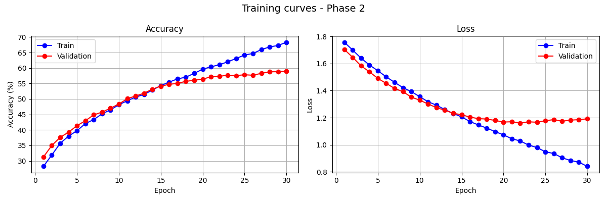
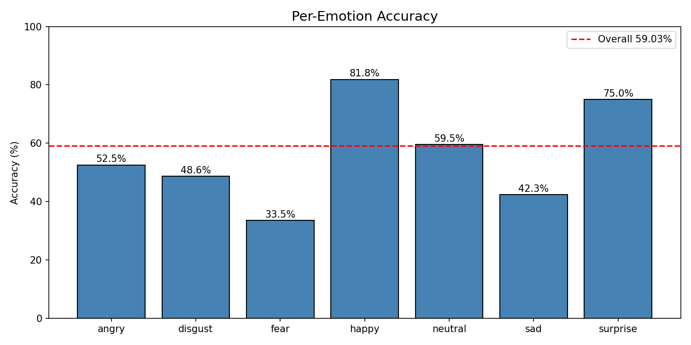
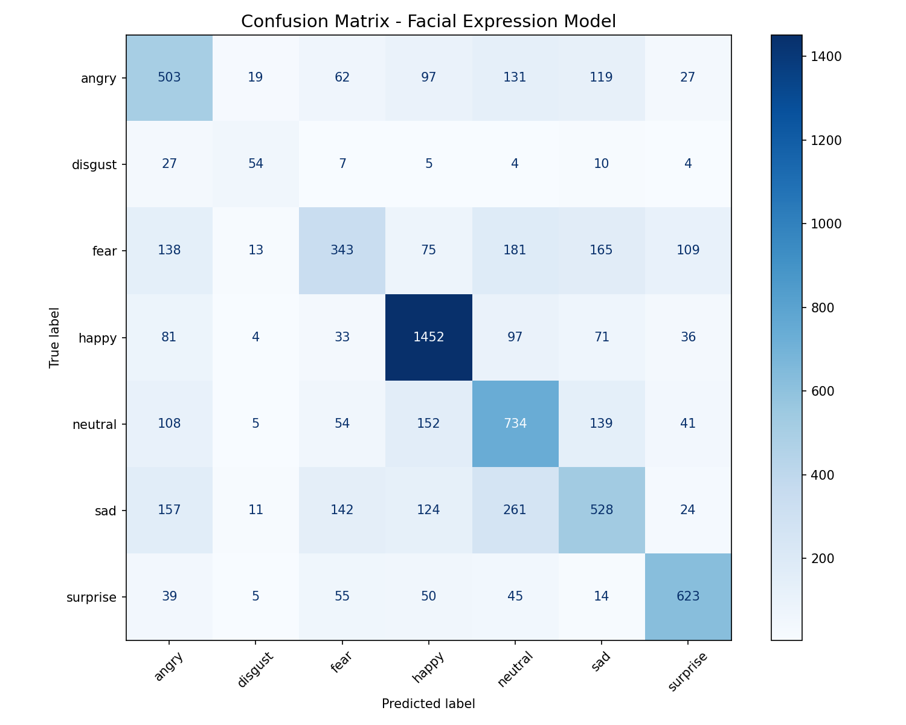

# Facial Expression Recognition Model


A complete deep learning project that recognizes human emotions from face images in real time. Built entirely from scratch — from understanding what a neural network is, all the way to deploying a working model on Hugging Face. Every single line of code is written and understood, not copied blindly.

## 🚀 Live Demo

**Try it here:** https://huggingface.co/spaces/mir-sajad-01/facial-expression-recognition

Upload any face photo and get instant emotion prediction!

**Use via API:**
```python
from gradio_client import Client, handle_file

client = Client("mir-sajad-01/facial-expression-recognition")
result = client.predict(
    image=handle_file('face.jpg'),
    api_name="/predict_emotion"
)
print(result)
```

---

## The Problem This Solves

Humans express emotions through their faces constantly — but machines have no idea what a smile or a frown means. This project teaches a neural network to recognize those expressions the same way a human learns: by seeing thousands of examples and gradually getting better at identifying patterns.

Real-world applications include:
- Mental health monitoring tools
- Driver drowsiness and attention detection
- Customer satisfaction analysis in retail
- Interactive gaming and AR experiences
- Accessibility tools for people with social communication difficulties

---

## What This Model Does

Takes any face image as input and outputs one of 7 emotion labels with confidence scores:

| Emotion  | F1 Score | Notes |
|----------|----------|-------|
| Happy    | 77.9%    | Best — most training data (7,215 images) |
| Surprise | 73.5%    | Strong performance |
| Neutral  | 54.7%    | Average |
| Angry    | 50.0%    | Average |
| Disgust  | 48.6%    | Limited by small dataset (436 images) |
| Sad      | 46.1%    | Visually similar to fear |
| Fear     | 39.9%    | Hardest — easily confused with sad |

---

## Training Results

| Metric | Score |
|--------|-------|
| Overall test accuracy | 59.03% |
| Human accuracy on FER2013 | ~65% |
| Phase 1 best accuracy | 27.64% |
| Phase 2 best accuracy | 59.03% |
| Total training epochs | 35 (5 + 30) |
| Training time (Colab T4 GPU) | ~45 minutes |
| Model size | ~9MB |
| Dataset size | 35,887 images |

### Training Curves — Phase 2


### Per-Emotion Accuracy


### Confusion Matrix


---

## Model Architecture

- **Base model:** MobileNetV2 pretrained on ImageNet
- **Input:** 48×48 grayscale face images
- **Output:** 7 emotion classes
- **Training strategy:** Two-phase transfer learning
  - Phase 1: Backbone frozen, only custom head trained (5 epochs)
  - Phase 2: Full model unfrozen and fine tuned (30 epochs)
- **Total parameters:** 2,553,031
- **Optimizer:** Adam with weight decay 1e-4
- **Loss function:** CrossEntropyLoss
- **Learning rate scheduler:** ReduceLROnPlateau

---

## Dataset

**FER2013 (Facial Expression Recognition 2013)**

| Split | Images |
|-------|--------|
| Training | 28,709 |
| Testing | 7,178 |
| Total | 35,887 |

Each image is 48×48 pixels in grayscale, labeled with one of 7 emotions.

**Class distribution (training set):**

| Emotion | Images | Notes |
|---------|--------|-------|
| Happy | 7,215 | Most data |
| Neutral | 4,965 | |
| Sad | 4,830 | |
| Fear | 4,097 | |
| Angry | 3,995 | |
| Surprise | 3,171 | |
| Disgust | 436 | Least data — class imbalance |

Source: https://www.kaggle.com/datasets/msambare/fer2013

The dataset is NOT uploaded to this repository due to its size.

---

## Project Stages

- [x] Stage 1: Project setup, environment configuration, GitHub workflow
- [x] Stage 2: Dataset download, cleaning, augmentation (FER2013 — 35,887 images)
- [x] Stage 3: Model architecture — Transfer Learning with MobileNetV2
- [x] Stage 4: Training — two-phase training on Google Colab T4 GPU
- [x] Stage 5: Evaluation — 59.03% accuracy, confusion matrix, per-emotion F1 scores
- [x] Stage 6: Export — ONNX and TorchScript formats
- [x] Stage 7: Deployment — live on Hugging Face Spaces with face detection
- [x] Stage 8: Final cleanup and documentation

---

## Tech Stack

| Tool | Version | Purpose |
|------|---------|---------|
| Python | 3.12 | Core language |
| PyTorch | 2.11 | Deep learning framework |
| Torchvision | 0.26 | Pretrained models and transforms |
| OpenCV | 4.12 | Face detection, image processing |
| Matplotlib | 3.9 | Visualization and training curves |
| scikit-learn | 1.5 | Confusion matrix, F1 scores |
| tqdm | 4.66 | Progress bars during training |
| Gradio | latest | Web interface for demo |
| Google Colab | T4 GPU | Free GPU used for training |
| Hugging Face | Spaces | Free model deployment |

---

## Project Structure

Facial-Expression-Model/
│
├── data/                    ← dataset (not on GitHub)
│
├── src/
│   ├── dataset.py           ← data loading and augmentation
│   ├── model.py             ← MobileNetV2 architecture
│   ├── train.py             ← two-phase training loop
│   ├── evaluate.py          ← confusion matrix and F1 scores
│   ├── export.py            ← ONNX and TorchScript export
│   ├── predict.py           ← run prediction on any image
│   └── visualize.py         ← dataset visualization
│
├── huggingface/
│   ├── app.py               ← Gradio web app (deployed on HF)
│   └── requirements.txt     ← Hugging Face dependencies
│
├── models/
│   ├── curves_phase1.png        ← Phase 1 training curves
│   ├── curves_phase2.png        ← Phase 2 training curves
│   ├── confusion_matrix.png     ← evaluation confusion matrix
│   ├── per_emotion_accuracy.png ← per-emotion accuracy
│   └── classification_report.txt← precision, recall, F1
│
├── check.py                 ← environment verification
├── requirements.txt         ← all dependencies
├── .gitignore               ← excludes data/, model weights
└── README.md                ← you are here

---

## Setup

### 1. Clone the repository
```bash
git clone https://github.com/mir-sajad-01/Facial-Expression-Model.git
cd Facial-Expression-Model
```

### 2. Install dependencies
```bash
python -m pip install -r requirements.txt
```

### 3. Verify setup
```bash
python check.py
```

### 4. Download the dataset
- Go to https://www.kaggle.com/datasets/msambare/fer2013
- Download and extract into the `data/` folder

### 5. Run prediction on an image
```bash
cd src
python predict.py
```

---

## Key Findings

**Strongest emotions:** Happy (77.9%) and Surprise (73.5%) — distinct visual features and sufficient training data.

**Weakest emotion:** Fear (39.9%) — frequently confused with Sad and Surprise due to shared facial features like raised eyebrows and wide eyes.

**Biggest challenge:** Class imbalance — Disgust had only 436 training images vs 7,215 for Happy. This directly caused lower performance on underrepresented emotions.

**Overfitting observation:** After Epoch 20, training accuracy continued climbing (68%) while validation plateaued (59%). Future fix: more aggressive dropout or early stopping at Epoch 23.

---

## Lessons Learned

**Stage 1:** Clean project structure from day one saves confusion later. A proper `.gitignore` prevents accidentally pushing 500MB of training data.

**Stage 2:** Always visualize your dataset before training. The class imbalance directly explains the model's weaknesses.

**Stage 3:** Transfer Learning with MobileNetV2 is the right choice for limited hardware — dramatically reduces training time and improves accuracy.

**Stage 4:** Two-phase training matters. Phase 1 gave 27% — fine tuning the full model jumped it to 59%.

**Stage 5:** Accuracy alone is misleading. The confusion matrix revealed the model is excellent at Happy but struggles with Fear.

**Stage 6:** Exporting to ONNX makes the model portable — runs anywhere without PyTorch.

**Stage 7:** Gradio + Hugging Face Spaces = free deployment in minutes. No server setup needed. Face detection with OpenCV improves real-world accuracy significantly.

---

## What Is Next

- Experiment with class-weighted loss to fix the disgust imbalance problem
- Try training on AffectNet (1 million images) for higher accuracy
- Build a real-time webcam demo

---

## Author

Built by Sajad Bashir Mir — B.Tech final year project.
Learning machine learning from absolute basics to full deployment.
No prior ML experience at the start of this project.

---

## License

MIT License — free to use, learn from, and build on.